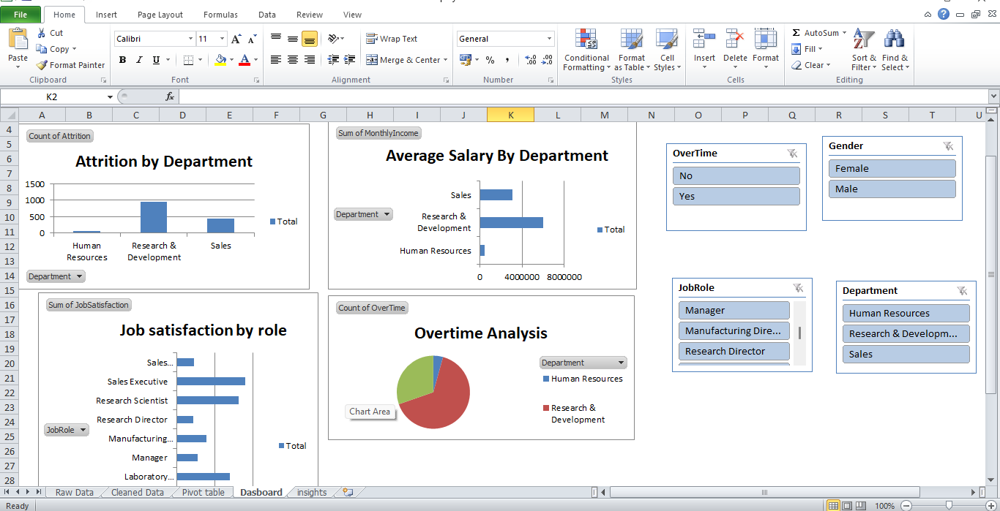
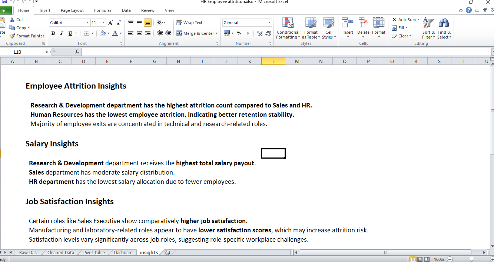

# HR Employee Attrition Analytics Dashboard

## Project Overview

This project analyzes employee attrition trends using Microsoft Excel dashboarding techniques. The dashboard helps HR teams identify workforce patterns, employee turnover trends, and factors affecting attrition.

---

## Dashboard Preview

### Dashboard Overview

### Employee Insights

---

## Objectives

- Analyze employee attrition trends
- Identify departments with high attrition
- Compare attrition by gender and job role
- Monitor overtime impact on employees
- Track important HR KPIs

---

## Tools Used

- Microsoft Excel
- Pivot Tables
- Pivot Charts
- Slicers
- Conditional Formatting
- KPI Cards

---

## Dataset Information

The dataset includes employee details such as:

- Age
- Gender
- Department
- Job Role
- Attrition
- Overtime
- Monthly Income
- Job Satisfaction
- Education
- Marital Status

---

## Key KPIs

- Total Employees
- Attrition Count
- Attrition Rate
- Average Age
- Average Monthly Income

---

## Dashboard Features

- Interactive filters using slicers
- Department-wise attrition analysis
- Gender-based employee comparison
- Overtime impact analysis
- Job role visualization
- Employee demographic insights

---

## Key Insights

- Employees working overtime show higher attrition.
- Some departments experience more employee turnover.
- Employee satisfaction impacts retention trends.
- Younger employees show different attrition patterns compared to senior employees.

---

## Conclusion

This dashboard provides useful HR analytics insights that help organizations understand employee attrition patterns and support better workforce decision-making.

